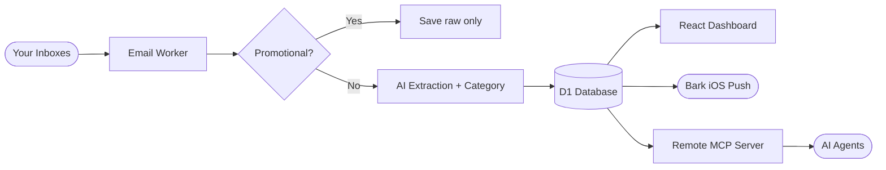

# Auth Inbox 📬

[English](https://github.com/TooonyChen/AuthInbox/blob/main/README.md) | [简体中文](https://github.com/TooonyChen/AuthInbox/blob/main/README_CN.md)

**Auth Inbox** is an open-source, self-hosted email verification code platform built on [Cloudflare](https://cloudflare.com/)'s free serverless services. It automatically processes incoming emails, filters out promotional mail before hitting the AI, extracts verification codes or links, classifies each mail, and stores everything in a database. A modern React dashboard with account login lets an **admin** manage everything, while **regular users** only see the mails an admin has granted them. AI agents can read the inbox too, through a built-in **remote MCP server**.

Don't want ads and spam in your main inbox? Need a bunch of alternative addresses for signups? Want your AI agent to complete sign-up flows by reading OTPs on its own? Try this **secure**, **serverless**, **lightweight** service!

[](https://deploy.workers.cloudflare.com/?url=https://github.com/TooonyChen/AuthInbox)



---

## Table of Contents 📑

- [Features](#features-)
- [Technologies Used](#technologies-used-)
- [Installation](#installation-)
- [Multi-User & Access Grants](#multi-user--access-grants-)
- [MCP Server (for AI Agents)](#mcp-server-for-ai-agents-)
- [Upgrading from v1](#upgrading-from-v1-)
- [License](#license-)
- [Screenshots](#screenshots-)

---

## Features ✨

- **Promotional Filter**: Detects and skips bulk/marketing emails via headers (`List-Unsubscribe`, `Precedence: bulk`, etc.) before calling the AI — saves tokens.
- **AI Code Extraction & Classification**: Any OpenAI-compatible or Anthropic provider extracts verification codes, links, and organization names, and tags each mail with a category (`login_code`, `registration`, `password_reset`, `account_security`, `payment`, `other`).
- **Multi-User Access Control**: Admin creates users and grants them access per address pattern and per category. Sensitive categories (password resets, account security alerts) are denied to regular users by default and raw email bodies are admin-only — enforced at the SQL query layer, for REST and MCP alike.
- **Remote MCP Server**: Every user can self-issue API keys and connect AI agents (Claude Code, Cursor, …) over Streamable HTTP. Includes a `wait_for_code` tool that blocks until a fresh OTP arrives — perfect for automated sign-up flows.
- **Modern Dashboard**: React 18 + shadcn/ui interface with account login, mail list with category badges, detail panel, API key management, and an admin page for users and grants.
- **Safe HTML Preview**: Email HTML is sanitized with DOMPurify and rendered in a sandboxed iframe (admin only).
- **One-click Copy**: Verification codes and links have copy buttons with toast confirmation.
- **Real-Time Notifications**: Optionally sends Bark push notifications when new codes arrive.
- **Database**: Stores all raw emails and AI-extracted results in Cloudflare D1, with schema managed by migrations.

---

## Technologies Used 🛠️

- **Cloudflare Workers** — Serverless runtime for email handling and API.
- **Hono** — Web framework for routing, middleware, and JWT sessions.
- **Cloudflare D1** — SQLite-compatible serverless database.
- **Cloudflare Email Routing** — Routes incoming emails to the Worker.
- **React 18 + Vite + Tailwind CSS + shadcn/ui** — Frontend dashboard.
- **Any OpenAI-compatible / Anthropic AI provider** — Configurable via env vars; Gemini, OpenAI, DeepSeek, Groq, Anthropic, and more.
- **Model Context Protocol (MCP)** — `@modelcontextprotocol/sdk` + `@hono/mcp` for the remote agent interface.
- **Bark API** — Optional iOS push notifications.
- **TypeScript** — End-to-end type safety.

---

## Installation ⚙️

### Prerequisites

- An API key from any supported AI provider (e.g. [Google AI Studio](https://aistudio.google.com/), OpenAI, Anthropic, DeepSeek, Groq)
- A domain bound to your [Cloudflare](https://dash.cloudflare.com/) account
- Cloudflare Account ID and API Token from [here](https://dash.cloudflare.com/profile/api-tokens)
- *(Optional)* [Bark App](https://bark.day.app/) for iOS push notifications

---

### Option 1 — Deploy via GitHub Actions

1. **Create D1 Database**

   Go to [Cloudflare Dashboard](https://dash.cloudflare.com/) → `Workers & Pages` → `D1 SQL Database` → `Create`. Name it `inbox-d1`.

   Copy the `database_id` for the next step. Tables are managed by the `migrations/` directory in this repo — the deploy workflow applies D1 migrations automatically before deploying.

2. **Fork & Deploy**

   [](https://deploy.workers.cloudflare.com/?url=https://github.com/TooonyChen/AuthInbox)

   In your forked repository, go to `Settings` → `Secrets and variables` → `Actions` and add:
   - `CLOUDFLARE_ACCOUNT_ID`
   - `CLOUDFLARE_API_TOKEN`
   - `TOML` — use the [comment-free template](https://github.com/TooonyChen/AuthInbox/blob/main/wrangler.toml.example.clear), fill in your D1 `database_id` and AI config, to avoid parse errors.

   Then go to `Actions` → `Deploy Auth Inbox to Cloudflare Workers` → `Run workflow`.

   After success, go to your Worker's `Settings` → `Variables and Secrets` and add a secret named `JWT_SECRET` (a long random string). Then open your Worker URL — since the users table is empty, the login page will prompt you to create the first admin account.

   **Delete the workflow logs** afterwards to avoid leaking your config.

3. Jump to [Set Email Forwarding](#3-set-email-forwarding-).

---

### Option 2 — Deploy via CLI

1. **Clone and install**

   ```bash
   git clone https://github.com/TooonyChen/AuthInbox.git
   cd AuthInbox
   pnpm install
   ```

2. **Create D1 database**

   ```bash
   pnpm wrangler d1 create inbox-d1
   ```

   Copy the `database_id` from the output.

3. **Configure**

   ```bash
   cp wrangler.toml.example wrangler.toml
   ```

   Edit `wrangler.toml` and fill in at least:

   ```toml
   [vars]
   UseBark = "false"

   # AI provider
   AI_BASE_URL    = "https://generativelanguage.googleapis.com/v1beta/openai"
   AI_API_KEY     = "your-api-key"
   AI_API_FORMAT  = "openai"
   AI_MODEL       = "gemini-2.0-flash"

   [[d1_databases]]
   binding       = "DB"
   database_name = "inbox-d1"
   database_id   = "<your-database-id>"
   ```

   **`AI_API_FORMAT`** is one of:

   | Value | Request path | Providers |
   |---|---|---|
   | `openai` | `/v1/chat/completions` | OpenAI, Gemini (OpenAI-compat), DeepSeek, Groq, Mistral, … |
   | `responses` | `/v1/responses` | OpenAI Responses API |
   | `anthropic` | `/v1/messages` | Anthropic Claude direct |

   **Common `AI_BASE_URL` values:**
   ```
   OpenAI:                https://api.openai.com
   Gemini (OpenAI-compat): https://generativelanguage.googleapis.com/v1beta/openai
   Anthropic:             https://api.anthropic.com
   DeepSeek:              https://api.deepseek.com
   Groq:                  https://api.groq.com/openai
   ```

   **Fallback provider (optional)**, used after the primary fails 3 retries:
   ```toml
   # AI_FALLBACK_BASE_URL   = "https://api.openai.com"
   # AI_FALLBACK_API_KEY    = "fallback-api-key"
   # AI_FALLBACK_API_FORMAT = "openai"
   # AI_FALLBACK_MODEL      = "gpt-4o-mini"
   ```

   Optional Bark config: `barkTokens`, `barkUrl`.

   Set the JWT secret (do **not** put it in `wrangler.toml` for production):

   ```bash
   pnpm exec wrangler secret put JWT_SECRET
   ```

4. **Build and deploy**

   ```bash
   pnpm run deploy
   ```

   This builds the frontend, applies remote D1 migrations, and deploys the Worker.

   Output: `https://auth-inbox.<your-subdomain>.workers.dev`

---

### 3. Set Email Forwarding ✉️

Go to [Cloudflare Dashboard](https://dash.cloudflare.com/) → `Websites` → `<your-domain>` → `Email` → `Email Routing` → `Routing Rules`.

**Catch-all address** (forward all mail to the Worker):


**Custom addresses** (forward specific addresses):


### 4. Done! 🎉

Open your Worker URL. On first visit (empty users table) the login page turns into a "create admin account" form — create the first admin and you're in.

---

## Multi-User & Access Grants 🔐

Two roles: **admin** and **user**.

- **Admin** sees everything: all mails, raw bodies, rendered HTML, user management, grant management.
- **User** only sees mails matched by grants an admin created for them, and never sees raw email bodies — only the AI-extracted results.

A **grant** = (user, address pattern, allowed categories, allow-sensitive flag):

- Address patterns use SQLite GLOB: `netflix@mail.example.com` for exact match, `*@mail.example.com` for a whole domain.
- Every mail is classified at ingest time: `login_code` / `registration` / `password_reset` / `account_security` / `payment` / `other`.
- `password_reset` and `account_security` are **sensitive**: even if listed in a grant, they are stripped unless the grant explicitly sets `allow_sensitive`. Fail-safe by design — a misclassified mail means a user sees one less mail, never one more.
- Mails ingested before v2 are categorized `legacy` and are always admin-only.

So a user can be allowed to read the Netflix **login code** sent to a shared address, while the Netflix **password reset** mail on the same address stays admin-only. Everything is enforced in a single SQL-level query function shared by the web API and the MCP server.

Manage users and grants in the dashboard's **Users & Access** page (admin only).

---

## MCP Server (for AI Agents) 🤖

Auth Inbox exposes a remote MCP server at `https://<your-worker-domain>/mcp` (Streamable HTTP).

1. Log in to the dashboard → **API Keys** → create a key (`aik_…`, shown only once). Keys inherit your role and grants.
2. Connect from Claude Code:

   ```bash
   claude mcp add --transport http authinbox https://your.domain/mcp \
     --header "Authorization: Bearer aik_xxx"
   ```

3. Available tools:

   | Tool | Purpose |
   |---|---|
   | `list_addresses` | List inbox addresses the key's user may read |
   | `list_codes` | List recent codes/links, filterable by address or service |
   | `get_latest_code` | Get the single most recent code for an address/service |
   | `wait_for_code` | Block (up to 55s) until a **new** code arrives — for automated sign-up/login flows |

All tools go through the same permission filter as the web API, so an agent holding a user's key can never read sensitive or raw content.

> claude.ai remote connectors require OAuth, which is not implemented yet — see TODO.

---

## Upgrading from v1 ⬆️

v2 is a breaking change:

1. **Basic Auth is gone.** `FrontEndAdminID` / `FrontEndAdminPassword` in `wrangler.toml` are no longer used — remove them. Accounts live in the D1 `users` table.
2. **Set a `JWT_SECRET`** secret: `pnpm exec wrangler secret put JWT_SECRET`.
3. **Run migrations**: `pnpm run db:migrate:remote` (also runs automatically in `pnpm run deploy` and the GitHub Actions workflow). Existing data is preserved; old mails are marked category `legacy` (admin-only).
4. **Create the first admin** on the login page after deploying (or `POST /api/auth/setup` — only works while the users table is empty).

---

## License 📜

[MIT License](LICENSE)

---

## Screenshots 📸


---

## Acknowledgements 🙏

- **Cloudflare Workers** for the powerful serverless platform.
- **Hono** and the **Model Context Protocol** teams.
- **shadcn/ui** for the component library.
- **Bark** for real-time push notifications.
- **The open-source community** for inspiration and support.

---

## TODO 📝

- [x] GitHub Actions auto-deploy
- [x] Fallback AI provider support
- [x] React dashboard (shadcn/ui)
- [x] Promotional filter (before any AI call)
- [x] Raw email view + sandboxed HTML preview
- [x] Multi-user support (admin/user roles + per-address, per-category grants)
- [x] Remote MCP server for AI agents
- [ ] OAuth on `/mcp` (for claude.ai remote connectors)
- [ ] Regex extraction (no-AI option)
- [ ] More notification channels (Slack, webhook, …)
- [ ] Email sending
