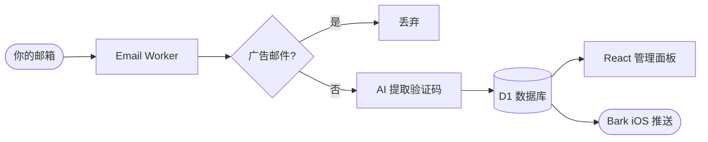

# Auth Inbox 验证邮局 📬

[English](https://github.com/TooonyChen/AuthInbox/blob/main/README.md) | [简体中文](https://github.com/TooonyChen/AuthInbox/blob/main/README_CN.md)

**Auth Inbox** 是一个开源的自建验证码接码平台，基于 [Cloudflare](https://cloudflare.com/) 的免费无服务器服务。它会自动处理收到的邮件，在调用 AI 之前过滤掉广告邮件，提取验证码或链接并存入数据库。现代化的 React 仪表盘让管理员可以查看提取的验证码、查看原始邮件内容、渲染 HTML 邮件预览，全程受 Basic Auth 保护。

不想在主邮箱中收到广告和垃圾邮件？需要多个备用邮箱用于注册各类服务？试试这个**安全**、**无服务器**、**轻量**的解决方案吧！

[](https://deploy.workers.cloudflare.com/?url=https://github.com/TooonyChen/AuthInbox)



---

## 目录 📑

- [功能](#功能-)
- [使用的技术](#使用的技术-)
- [安装](#安装-)
- [许可证](#许可证-)
- [截图](#截图-)

---

## 功能 ✨

- **广告过滤**：通过邮件头（`List-Unsubscribe`、`Precedence: bulk` 等）识别并跳过营销邮件，不调用 AI，节省 token。
- **AI 验证码提取**：使用 Google Gemini（OpenAI 作为备用）提取验证码、链接和组织名称。
- **现代化仪表盘**：React 18 + shadcn/ui 界面，包含邮件列表、详情面板和三个 Tab —— 提取内容、原始邮件、HTML 渲染预览。
- **安全 HTML 预览**：邮件 HTML 经 DOMPurify 净化后在沙箱 iframe 中渲染。
- **一键复制**：验证码和链接均有复制按钮，复制后有 Toast 提示。
- **实时通知**：可选接入 Bark，收到新验证码时推送到 iOS 设备。
- **数据库存储**：所有原始邮件和 AI 提取结果均存入 Cloudflare D1。

---

## 使用的技术 🛠️

- **Cloudflare Workers** — 处理邮件和 API 的无服务器运行时。
- **Cloudflare D1** — 兼容 SQLite 的无服务器数据库。
- **Cloudflare Email Routing** — 将收到的邮件路由到 Worker。
- **React 18 + Vite + Tailwind CSS + shadcn/ui** — 前端仪表盘。
- **任意 OpenAI 兼容 / Anthropic AI 提供商** — 通过环境变量配置，支持 Gemini、OpenAI、DeepSeek、Groq、Anthropic 等。
- **Bark API** — iOS 实时推送通知（可选）。
- **TypeScript** — 端到端类型安全。

---

## 安装 ⚙️

### 先决条件

- 一个 [Google AI Studio API Key](https://aistudio.google.com/)
- 在 [Cloudflare](https://dash.cloudflare.com/) 账户上绑定一个域名
- Cloudflare 账户 ID 和 API Token，可在 [此处](https://dash.cloudflare.com/profile/api-tokens) 获取
- *（可选）* [Bark App](https://bark.day.app/)，用于 iOS 推送通知

---

### 方式一 — 通过 GitHub Actions 部署

1. **创建 D1 数据库**

   进入 [Cloudflare 仪表盘](https://dash.cloudflare.com/) → `Workers & Pages` → `D1 SQL Database` → `Create`，名称填 `inbox-d1`。

   复制 `database_id`，下一步会用到。数据库表由仓库里的 `migrations/` 管理，部署 workflow 会先执行 D1 migrations。

2. **Fork 并部署**

   [](https://deploy.workers.cloudflare.com/?url=https://github.com/TooonyChen/AuthInbox)

   在你 Fork 的仓库中，进入 `Settings` → `Secrets and variables` → `Actions`，添加以下 Secrets：
   - `CLOUDFLARE_ACCOUNT_ID`
   - `CLOUDFLARE_API_TOKEN`
   - `TOML` — 使用[不带注释的模板](https://github.com/TooonyChen/AuthInbox/blob/main/wrangler.toml.example.clear)，填入 D1 `database_id` 和 AI 配置，避免解析报错。

   然后进入 `Actions` → `Deploy Auth Inbox to Cloudflare Workers` → `Run workflow`。

   部署成功后，到 Cloudflare Worker 的 `Settings` → `Variables and Secrets` 添加 secret：`JWT_SECRET`（一串足够长的随机字符串）。首次打开登录页时，系统会在 users 表为空时引导你创建第一个 admin。

   **务必删除 workflow 日志**，防止配置信息泄露。

3. 跳转到[设置邮件转发](#3-设置邮件转发-)。

---

### 方式二 — 通过命令行部署

1. **克隆并安装依赖**

   ```bash
   git clone https://github.com/TooonyChen/AuthInbox.git
   cd AuthInbox
   pnpm install
   ```

2. **创建 D1 数据库**

   ```bash
   pnpm wrangler d1 create inbox-d1
   ```

   复制输出中的 `database_id`。

3. **配置**

   ```bash
   cp wrangler.toml.example wrangler.toml
   ```

   编辑 `wrangler.toml`，至少填写以下内容：

   ```toml
   [vars]
   UseBark = "false"

   # AI 提供商配置
   AI_BASE_URL    = "https://generativelanguage.googleapis.com/v1beta/openai"
   AI_API_KEY     = "你的 API Key"
   AI_API_FORMAT  = "openai"
   AI_MODEL       = "gemini-2.0-flash"

   [[d1_databases]]
   binding       = "DB"
   database_name = "inbox-d1"
   database_id   = "<你的数据库ID>"
   ```

   `FrontEndAdminID` / `FrontEndAdminPassword` 已不再使用。用户存储在 D1 的 `users` 表里；首次部署后通过登录页创建第一个 admin。

   **`AI_API_FORMAT`** 三选一：

   | 值 | 实际请求路径 | 适用提供商 |
   |---|---|---|
   | `openai` | `/v1/chat/completions` | OpenAI、Gemini（OpenAI 兼容）、DeepSeek、Groq、Mistral 等 |
   | `responses` | `/v1/responses` | OpenAI Responses API |
   | `anthropic` | `/v1/messages` | Anthropic Claude 直连 |

   **常用 `AI_BASE_URL`：**
   ```
   OpenAI:                https://api.openai.com
   Gemini（OpenAI 兼容）: https://generativelanguage.googleapis.com/v1beta/openai
   Anthropic:             https://api.anthropic.com
   DeepSeek:              https://api.deepseek.com
   Groq:                  https://api.groq.com/openai
   ```

   **备用模型（可选）**，主模型失败重试 3 次后触发：
   ```toml
   # AI_FALLBACK_BASE_URL   = "https://api.openai.com"
   # AI_FALLBACK_API_KEY    = "备用 API Key"
   # AI_FALLBACK_API_FORMAT = "openai"
   # AI_FALLBACK_MODEL      = "gpt-4o-mini"
   ```

   可选 Bark 配置：`barkTokens`、`barkUrl`。

   设置 JWT secret（生产环境不要写进 `wrangler.toml`）：

   ```bash
   pnpm exec wrangler secret put JWT_SECRET
   ```

4. **构建并部署**

   ```bash
   pnpm run deploy
   ```

   `pnpm run deploy` 会依次构建前端、执行远端 D1 migrations、部署 Worker。

   输出：`https://auth-inbox.<你的子域名>.workers.dev`

---

### 3. 设置邮件转发 ✉️

进入 [Cloudflare 仪表盘](https://dash.cloudflare.com/) → `Websites` → `<你的域名>` → `Email` → `Email Routing` → `Routing Rules`。

**接收所有地址**（将所有邮件转发给 Worker）：


**自定义地址**（转发特定地址）：


### 4. 完成！🎉

访问你的 Worker URL，用你设置的账号密码登录，即可开始接收验证邮件。

---

## 许可证 📜

[MIT License](LICENSE)

---

## 截图 📸


---

## 鸣谢 🙏

- **Cloudflare Workers** 提供强大的无服务器平台。
- **Google Gemini AI** 提供智能邮件内容提取能力。
- **Bark** 提供实时推送通知。
- **shadcn/ui** 提供组件库。
- **开源社区** 提供灵感与支持。

---

## TODO 📝

- [x] GitHub Actions 自动部署
- [x] OpenAI 备用模型支持
- [x] React 仪表盘（shadcn/ui）
- [x] 广告邮件过滤（调用 AI 前拦截）
- [x] 原始邮件查看 + 沙箱 HTML 预览
- [ ] 正则表达式提取（无 AI 选项）
- [ ] 多用户支持
- [ ] 更多通知方式（Slack、Webhook 等）
- [ ] 发送邮件功能
