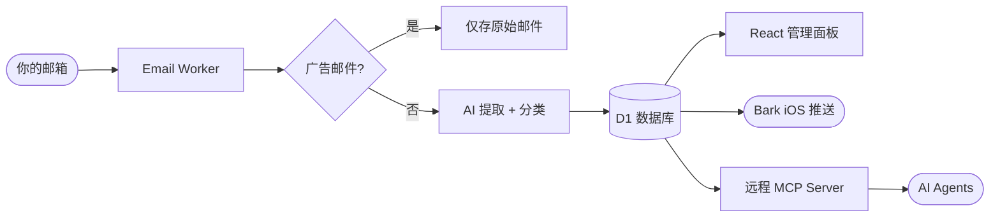

# Auth Inbox 验证邮局 📬

[English](https://github.com/TooonyChen/AuthInbox/blob/main/README.md) | [简体中文](https://github.com/TooonyChen/AuthInbox/blob/main/README_CN.md)

**Auth Inbox** 是一个开源的自建验证码接码平台，基于 [Cloudflare](https://cloudflare.com/) 的免费无服务器服务。它会自动处理收到的邮件，在调用 AI 之前过滤掉广告邮件，提取验证码或链接、自动分类并存入数据库。现代化的 React 仪表盘支持账号登录：**admin** 管理一切，**普通用户**只能看到 admin 授权范围内的邮件。内置**远程 MCP Server**，AI agent 也能直接读取收件箱。

不想在主邮箱中收到广告和垃圾邮件？需要多个备用邮箱用于注册各类服务？想让 AI agent 自己读验证码完成注册流程？试试这个**安全**、**无服务器**、**轻量**的解决方案吧！

[](https://deploy.workers.cloudflare.com/?url=https://github.com/TooonyChen/AuthInbox)



---

## 目录 📑

- [功能](#功能-)
- [使用的技术](#使用的技术-)
- [安装](#安装-)
- [多用户与授权](#多用户与授权-)
- [MCP Server（AI Agent 接入）](#mcp-serverai-agent-接入-)
- [从 v1 升级](#从-v1-升级-)
- [许可证](#许可证-)
- [截图](#截图-)

---

## 功能 ✨

- **广告过滤**：通过邮件头（`List-Unsubscribe`、`Precedence: bulk` 等）识别并跳过营销邮件，不调用 AI，节省 token。
- **AI 验证码提取与分类**：支持任意 OpenAI 兼容 / Anthropic 提供商，提取验证码、链接和组织名称，并给每封邮件打上分类标签（`login_code` / `registration` / `password_reset` / `account_security` / `payment` / `other`）。
- **多用户权限管理**：admin 创建用户，按地址 pattern + 分类授权。敏感分类（改密码、账户安全警告）对普通用户默认拒绝，邮件原文仅 admin 可见 —— 权限在 SQL 查询层强制执行，REST 和 MCP 共用同一套过滤。
- **远程 MCP Server**：claude.ai 可通过内置 OAuth（动态客户端注册 + PKCE）作为远程连接器直连；支持自定义 header 的客户端（Claude Code、Cursor 等）也可自助签发 API key 通过 Streamable HTTP 接入。`wait_for_code` 工具可阻塞等待新验证码送达，适合自动注册流程。
- **现代化仪表盘**：React 18 + shadcn/ui 界面，账号登录、带分类徽章的邮件列表、详情面板、API key 管理，以及 admin 专属的用户/授权管理页。
- **安全 HTML 预览**：邮件 HTML 经 DOMPurify 净化后在沙箱 iframe 中渲染（仅 admin）。
- **一键复制**：验证码和链接均有复制按钮，复制后有 Toast 提示。
- **实时通知**：可选接入 Bark，收到新验证码时推送到 iOS 设备。
- **数据库存储**：所有原始邮件和 AI 提取结果均存入 Cloudflare D1，schema 由 migrations 管理。

---

## 使用的技术 🛠️

- **Cloudflare Workers** — 处理邮件和 API 的无服务器运行时。
- **Hono** — Web 框架，负责路由、中间件和 JWT 会话。
- **Cloudflare D1** — 兼容 SQLite 的无服务器数据库。
- **Cloudflare Email Routing** — 将收到的邮件路由到 Worker。
- **React 18 + Vite + Tailwind CSS + shadcn/ui** — 前端仪表盘。
- **任意 OpenAI 兼容 / Anthropic AI 提供商** — 通过环境变量配置，支持 Gemini、OpenAI、DeepSeek、Groq、Anthropic 等。
- **Model Context Protocol (MCP)** — `@modelcontextprotocol/sdk` + `@hono/mcp` 提供远程 agent 接口。
- **Bark API** — iOS 实时推送通知（可选）。
- **TypeScript** — 端到端类型安全。

---

## 安装 ⚙️

### 先决条件

- 任意受支持 AI 提供商的 API Key（如 [Google AI Studio](https://aistudio.google.com/)、OpenAI、Anthropic、DeepSeek、Groq）
- 在 [Cloudflare](https://dash.cloudflare.com/) 账户上绑定一个域名
- Cloudflare 账户 ID 和 API Token，可在 [此处](https://dash.cloudflare.com/profile/api-tokens) 获取
- *（可选）* [Bark App](https://bark.day.app/)，用于 iOS 推送通知

---

### 方式一 — 通过 GitHub Actions 部署

1. **创建 D1 数据库**

   进入 [Cloudflare 仪表盘](https://dash.cloudflare.com/) → `Workers & Pages` → `D1 SQL Database` → `Create`，名称填 `inbox-d1`。

   复制 `database_id`，下一步会用到。数据库表由仓库里的 `migrations/` 管理，部署 workflow 会先执行 D1 migrations。

   *（可选 —— 仅当你要把 claude.ai 作为远程 MCP 连接器接入时）* 再进入 `Storage & Databases` → `KV` → `Create a namespace`，名称填 `OAUTH_KV`，复制它的 namespace ID。不创建则 OAuth 关闭，MCP Server 只支持 API key 接入。

2. **Fork 并部署**

   [](https://deploy.workers.cloudflare.com/?url=https://github.com/TooonyChen/AuthInbox)

   在你 Fork 的仓库中，进入 `Settings` → `Secrets and variables` → `Actions`，添加以下 Secrets：
   - `CLOUDFLARE_ACCOUNT_ID`
   - `CLOUDFLARE_API_TOKEN`
   - `TOML` — 使用[不带注释的模板](https://github.com/TooonyChen/AuthInbox/blob/main/wrangler.toml.example.clear)，填入 D1 `database_id` 和 AI 配置（如果创建了 `OAUTH_KV` 也填上它的 namespace id），避免解析报错。

   然后进入 `Actions` → `Deploy Auth Inbox to Cloudflare Workers` → `Run workflow`。

   部署成功后，到 Cloudflare Worker 的 `Settings` → `Variables and Secrets` 添加 secret：`JWT_SECRET`（一串足够长的随机字符串）。首次打开登录页时，系统会在 users 表为空时引导你创建第一个 admin。

   **务必删除 workflow 日志**，防止配置信息泄露。

3. 跳转到[设置邮件转发](#3-设置邮件转发-)。

---

### 方式二 — 通过命令行部署

1. **克隆并安装依赖**

   ```bash
   git clone https://github.com/TooonyChen/AuthInbox.git
   cd AuthInbox
   pnpm install
   ```

2. **创建 D1 数据库**

   ```bash
   pnpm wrangler d1 create inbox-d1
   ```

   复制输出中的 `database_id`。

   *（可选 —— 仅当你要接入 claude.ai 远程连接器时）* 再创建 OAuth KV：

   ```bash
   pnpm wrangler kv namespace create OAUTH_KV
   ```

   不创建则 OAuth 关闭，MCP Server 只支持 API key 接入。

3. **配置**

   ```bash
   cp wrangler.toml.example wrangler.toml
   ```

   编辑 `wrangler.toml`，至少填写以下内容：

   ```toml
   [vars]
   UseBark = "false"

   # AI 提供商配置
   AI_BASE_URL    = "https://generativelanguage.googleapis.com/v1beta/openai"
   AI_API_KEY     = "你的 API Key"
   AI_API_FORMAT  = "openai"
   AI_MODEL       = "gemini-2.0-flash"

   [[d1_databases]]
   binding       = "DB"
   database_name = "inbox-d1"
   database_id   = "<你的数据库ID>"

   # 可选 —— 仅当接入 claude.ai 远程连接器 (OAuth) 时:
   # [[kv_namespaces]]
   # binding = "OAUTH_KV"   # 绑定名必须是 OAUTH_KV
   # id      = "<你的 KV namespace ID>"
   ```

   `FrontEndAdminID` / `FrontEndAdminPassword` 已不再使用。用户存储在 D1 的 `users` 表里；首次部署后通过登录页创建第一个 admin。

   **`AI_API_FORMAT`** 三选一：

   | 值 | 实际请求路径 | 适用提供商 |
   |---|---|---|
   | `openai` | `/v1/chat/completions` | OpenAI、Gemini（OpenAI 兼容）、DeepSeek、Groq、Mistral 等 |
   | `responses` | `/v1/responses` | OpenAI Responses API |
   | `anthropic` | `/v1/messages` | Anthropic Claude 直连 |

   **常用 `AI_BASE_URL`：**
   ```
   OpenAI:                https://api.openai.com
   Gemini（OpenAI 兼容）: https://generativelanguage.googleapis.com/v1beta/openai
   Anthropic:             https://api.anthropic.com
   DeepSeek:              https://api.deepseek.com
   Groq:                  https://api.groq.com/openai
   ```

   **备用模型（可选）**，主模型失败重试 3 次后触发：
   ```toml
   # AI_FALLBACK_BASE_URL   = "https://api.openai.com"
   # AI_FALLBACK_API_KEY    = "备用 API Key"
   # AI_FALLBACK_API_FORMAT = "openai"
   # AI_FALLBACK_MODEL      = "gpt-4o-mini"
   ```

   可选 Bark 配置：`barkTokens`、`barkUrl`。

   设置 JWT secret（生产环境不要写进 `wrangler.toml`）：

   ```bash
   pnpm exec wrangler secret put JWT_SECRET
   ```

4. **构建并部署**

   ```bash
   pnpm run deploy
   ```

   `pnpm run deploy` 会依次构建前端、执行远端 D1 migrations、部署 Worker。

   输出：`https://auth-inbox.<你的子域名>.workers.dev`

---

### 3. 设置邮件转发 ✉️

进入 [Cloudflare 仪表盘](https://dash.cloudflare.com/) → `Websites` → `<你的域名>` → `Email` → `Email Routing` → `Routing Rules`。

**接收所有地址**（将所有邮件转发给 Worker）：


**自定义地址**（转发特定地址）：


### 4. 完成！🎉

访问你的 Worker URL。首次访问（users 表为空）时，登录页会自动变成"创建 admin 账号"表单，创建第一个 admin 后即可开始接收验证邮件。

---

## 多用户与授权 🔐

两种角色：**admin** 和 **user**。

- **admin** 可以看到一切：所有邮件、原始邮件、HTML 渲染、用户管理、授权管理。
- **user** 只能看到 admin 通过 grant 授权范围内的邮件，且永远看不到邮件原文，只能看到 AI 提取后的结构化结果。

一条 **grant** = （用户，地址 pattern，允许的分类，是否放行敏感类）：

- 地址 pattern 使用 SQLite GLOB：`netflix@mail.example.com` 精确匹配，`*@mail.example.com` 匹配整个域名。
- 每封邮件在进件时由 AI 分类：`login_code` / `registration` / `password_reset` / `account_security` / `payment` / `other`。
- `password_reset` 和 `account_security` 是**敏感分类**：即使写进了 grant，只要没有显式勾选 `allow_sensitive` 就会被服务层剔除。这个设计是故障安全的 —— 分类错误的代价只是"用户少看到一封该看的邮件"，而不是"看到了不该看的重置链接"。
- v2 之前的历史邮件分类为 `legacy`，永远只有 admin 可见。

因此可以做到：user 能看到发到共享地址的 Netflix **登录验证码**，但同一地址收到的 Netflix **改密码邮件**只有 admin 可见。所有过滤由 web API 和 MCP Server 共用的同一个 SQL 查询函数强制执行。

用户和授权在仪表盘的 **Users & Access** 页面管理（仅 admin 可见）。

---

## MCP Server（AI Agent 接入）🤖

Auth Inbox 在 `https://<你的 Worker 域名>/mcp` 暴露一个远程 MCP Server（Streamable HTTP）。两种认证方式：

**方式 A — OAuth（claude.ai 远程连接器，以及任何支持 OAuth 的 MCP 客户端）**

需要可选的 `OAUTH_KV` 绑定（见安装章节）。打开 claude.ai → `Settings` → `Connectors` → `Add custom connector`，填入 `https://your.domain/mcp` 即可。Claude 会自动发现 OAuth 服务（动态客户端注册 + PKCE），跳转到 Auth Inbox 的登录/授权页，以你的账号身份连接。token 继承你的角色和授权；在仪表盘删除用户会立即使其 OAuth 访问失效。

**方式 B — API key（Claude Code、Cursor、脚本等）**

1. 登录仪表盘 → **API Keys** → 创建 key（`aik_…`，只显示一次）。key 继承创建者的角色和授权。
2. 在 Claude Code 中接入：

   ```bash
   claude mcp add --transport http authinbox https://your.domain/mcp \
     --header "Authorization: Bearer aik_xxx"
   ```

**可用工具：**

   | 工具 | 用途 |
   |---|---|
   | `list_addresses` | 列出该 key 对应用户可读的收件地址 |
   | `list_codes` | 列出最近的验证码/链接，可按地址或服务筛选 |
   | `get_latest_code` | 获取某地址/服务最新的一条验证码 |
   | `wait_for_code` | 阻塞等待（最长 55 秒）**新**验证码送达 —— 自动注册/登录流程的关键工具 |

所有工具走与 web API 相同的权限过滤，拿着 user key 或 OAuth token 的 agent 永远读不到敏感分类和邮件原文。

---

## 从 v1 升级 ⬆️

v2 是破坏性变更：

1. **Basic Auth 已移除。**`wrangler.toml` 里的 `FrontEndAdminID` / `FrontEndAdminPassword` 不再使用，可以删除。账号存储在 D1 的 `users` 表中。
2. **设置 `JWT_SECRET`** secret：`pnpm exec wrangler secret put JWT_SECRET`。
3. **执行迁移**：`pnpm run db:migrate:remote`（`pnpm run deploy` 和 GitHub Actions workflow 也会自动执行）。现有数据保留；旧邮件会被标记为 `legacy` 分类（仅 admin 可见）。
4. **创建第一个 admin**：部署后在登录页创建（或调用 `POST /api/auth/setup`，仅在 users 表为空时可用）。

---

## 许可证 📜

[MIT License](LICENSE)

---

## 截图 📸


---

## 鸣谢 🙏

- **Cloudflare Workers** 提供强大的无服务器平台。
- **Hono** 和 **Model Context Protocol** 团队。
- **shadcn/ui** 提供组件库。
- **Bark** 提供实时推送通知。
- **开源社区** 提供灵感与支持。

---

## TODO 📝

- [x] GitHub Actions 自动部署
- [x] 备用 AI 模型支持
- [x] React 仪表盘（shadcn/ui）
- [x] 广告邮件过滤（调用 AI 前拦截）
- [x] 原始邮件查看 + 沙箱 HTML 预览
- [x] 多用户支持（admin/user 角色 + 按地址、按分类授权）
- [x] 远程 MCP Server（AI Agent 接入）
- [x] `/mcp` 支持 OAuth（接入 claude.ai 远程连接器）
- [ ] 正则表达式提取（无 AI 选项）
- [ ] 更多通知方式（Slack、Webhook 等）
- [ ] 发送邮件功能
